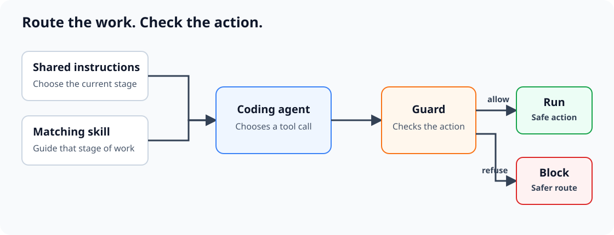

# agent-config

One install gives Claude Code and Codex the same software-delivery workflow and
blocks common destructive mistakes.

## Install

```bash
npx @sid-thephysicskid/agent-config@latest install
```

That installs:

- guardrails for destructive Git, filesystem, credential, database, and deploy actions;
- 13 workflow skills;
- automatic skill routing for Claude Code and Codex;
- `agent-init` for shared project instructions.

Restart your coding agent after installation. Codex will ask you to review new
hooks in `/hooks`.

macOS and Linux are supported. You need Node 20 or newer and Python 3.9 or newer.

### Existing setups

The installer scans first, then adds only what it owns.

- Existing hooks, settings, instructions, and unrelated skills stay in place.
- Existing instruction files receive one removable Agent Config block.
- A same-name skill is kept by default in non-interactive installs. In a
  terminal, one prompt lets you keep all conflicts or back them up and use this package.
- Re-running the command repairs or upgrades the installation.
- If installation cannot complete safely, it stops before wiring the package.

To choose conflict behavior up front:

```bash
npx @sid-thephysicskid/agent-config@latest install --keep-existing
npx @sid-thephysicskid/agent-config@latest install --replace-conflicts
```

## How the agent uses it

<p align="center">
  
</p>

The installer puts the same routing instructions where Claude Code and Codex
load them. On a clean machine, both files point to one shared source. If you
already have instructions, the installer adds the same bounded block to each.

The agent enters at the stage your task needs. It does not run every skill as a
waterfall:

```text
navigate → prototype → bootstrap/setup → to-spec → breakdown
         → domain-modeling → architect → tdd/diagnose → review → ship
```

`unstick` handles merge and rebase conflicts.

The package ships 13 workflow skills and 3 optional operator skills.

| Skill | Use it for |
|---|---|
| `navigate` | Make or challenge a decision. |
| `prototype` | Test one unresolved question. |
| `bootstrap` | Start a repository with a working delivery path. |
| `setup` | Adopt an existing repository. |
| `to-spec` | Capture decided behavior and acceptance criteria. |
| `breakdown` | Create independently shippable work items. |
| `domain-modeling` | Define business language, rules, states, and ownership. |
| `architect` | Design a module, seam, migration, or boundary. |
| `tdd` | Implement testable behavior in small cycles. |
| `diagnose` | Find a root cause with evidence. |
| `review` | Review correctness, security, and maintainability. |
| `unstick` | Resolve Git conflicts without discarding intent. |
| `ship` | Verify and deliver authorized work. |

### Project instructions

For a new project, `bootstrap` creates a real root `AGENTS.md` and a relative
`CLAUDE.md -> AGENTS.md` symlink. `setup` does the same when adopting an existing
repository. Both agents then read one project contract.

You can also create it directly:

```bash
npx @sid-thephysicskid/agent-config@latest init
```

Existing project instruction files are never replaced.

## Guard

The guard checks an action immediately before it runs:

```console
$ git push origin main
BLOCKED: pushing directly at 'main'.

Do this instead: push your feature branch and open a PR
```

It is a safety net, not a sandbox. Keep branch protection, least-privilege
credentials, database roles, backups, CI, and human review.

## Optional extras

Add `research`, `wizard`, `handoff`, and concise output styles:

```bash
npx @sid-thephysicskid/agent-config@latest install --extras
```

## Check or remove

```bash
npx @sid-thephysicskid/agent-config@latest doctor
npx @sid-thephysicskid/agent-config@latest uninstall
```

Uninstall removes Agent Config links, hook entries, instruction blocks, and
deny rules. A conflicting skill replaced during install is restored from its backup.

<details>
<summary><strong>Install from source</strong></summary>

```bash
git clone https://github.com/sid-thephysicskid/agent-config.git
cd agent-config
./install.sh standard
```

Keep the checkout in place while installed. Source installs use symlinks.

</details>

## Credit

Some skills adapt work from [Matt Pocock's open-source skills](https://github.com/mattpocock/skills).
See [THIRD-PARTY-NOTICES.md](THIRD-PARTY-NOTICES.md) for licenses and attribution.

## License

MIT. See [SECURITY.md](SECURITY.md) for security reports and
[CONTRIBUTING.md](CONTRIBUTING.md) for contributions.
