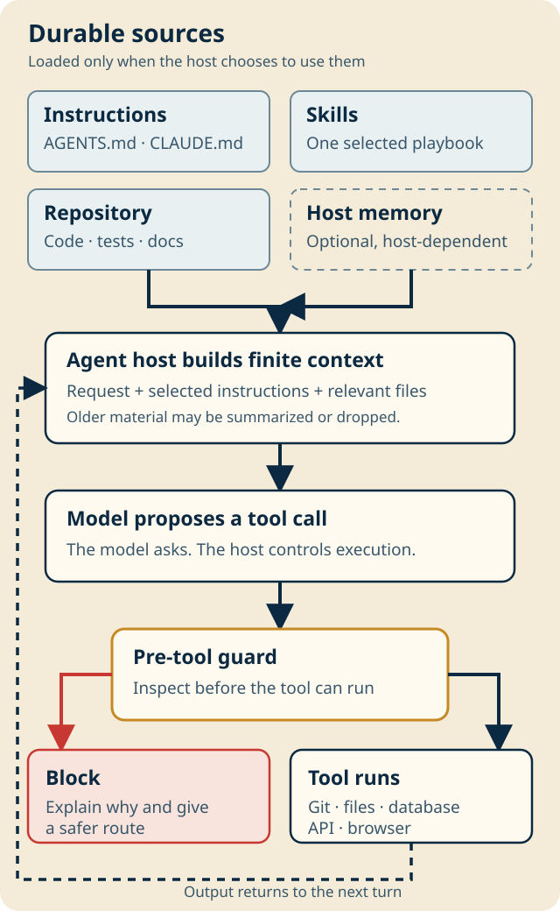
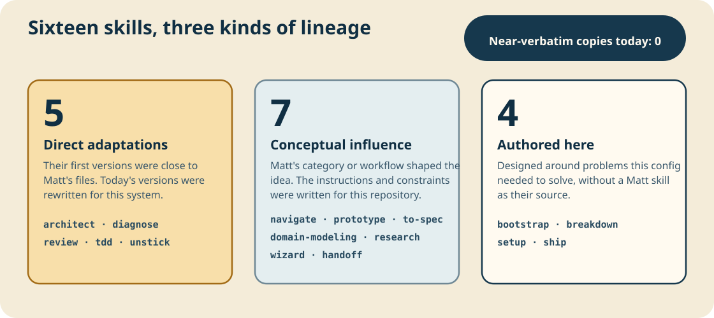

<p align="center">
  
</p>

# agent-config

Guardrails and focused delivery workflows for Claude Code and Codex.

**A skill is advice. A hook is a wall.** Skills give the agent a route from an unclear request to a verified release. A local pre-tool hook blocks a short list of destructive mistakes before the command runs.

## Install

### From npm

```bash
npx @sid-thephysicskid/agent-config@latest install guard
npx @sid-thephysicskid/agent-config@latest install workflow
npx @sid-thephysicskid/agent-config@latest install operator
npx @sid-thephysicskid/agent-config@latest install full
npx @sid-thephysicskid/agent-config@latest doctor guard
npx @sid-thephysicskid/agent-config@latest uninstall guard
```

The default is `guard`. The npm installer copies versioned files to
`~/.local/share/agent-config/`, so the installation does not depend on npm's
temporary cache.

### From a checkout

To inspect the source before installing:

```bash
git clone https://github.com/sid-thephysicskid/agent-config.git
cd agent-config
./install.sh guard
```

Use `workflow`, `operator`, or `full` instead of `guard` to install another
profile. The checkout installer creates symlinks into the clone, so keep the
clone in place while it is installed.

Check or remove a profile:

```bash
./install.sh guard --check
./uninstall.sh guard
```

macOS and Linux are supported. Native Windows is not supported, and WSL is not yet verified. Node 18 or newer is required for the installer. The guard also requires Python 3.8 or newer.

Review local hooks before trusting them. Codex also requires approval in `/hooks` after installation.

| Layer | What it adds | What it does not add |
|---|---|---|
| `guard` | Deterministic checks before risky tool calls | Skills or global opinions |
| `workflow` | Thirteen software-delivery skills and shared agent instructions | Hooks |
| `operator` | Research, handoff, credential setup, and communication options | Core workflow or hooks |
| `full` | All three layers | Nothing beyond this repository |

Both installers refuse occupied paths instead of overwriting them.

## Guard

The guard blocks common high-impact mistakes involving:

- protected Git branches and destructive history changes;
- live credential files;
- broad filesystem deletion;
- destructive or production-looking database commands;
- direct production deploys and irreversible infrastructure actions;
- writes to Git internals or the guard's own files.

```console
$ git push origin main
BLOCKED: pushing directly at 'main'.

Do this instead: push your feature branch and open a PR
```

It inspects shell commands, file operations, Codex patches, and common MCP file-tool payloads. A refusal explains what was blocked and gives the safe route.

This is a safety net for mistakes, not a sandbox. Deliberate evasion can bypass
text analysis. Anything with shell access can modify user-owned hooks. Internal
errors and ordinary analysis timeouts fail open. A timeout on a command whose
text matches a destructive shape is refused. Use protected branches,
least-privilege credentials, database roles, backups, CI, and human review as
the stronger controls.

## Workflow

The workflow follows the work instead of forcing every project through every step:

```text
navigate → prototype → bootstrap/setup → to-spec → breakdown
         → domain-modeling → architect → tdd/diagnose → review → ship
```

`unstick` handles merge and rebase conflicts.

<details>
<summary><strong>What each skill owns</strong></summary>

| Skill | One job |
|---|---|
| `navigate` | Reach a decision or break a weak plan. |
| `prototype` | Answer one unresolved question with disposable evidence. |
| `bootstrap` | Start a repository with a working delivery path. |
| `setup` | Adopt an existing repository without guessing its commands or tracker. |
| `to-spec` | Turn decided behavior into an acceptance contract. |
| `breakdown` | Produce independently shippable work items. |
| `domain-modeling` | Define business language, rules, states, and ownership. |
| `architect` | Design a deep module or rank architecture improvements. |
| `tdd` | Build business behavior in red, green, refactor cycles. |
| `diagnose` | Establish root cause through evidence and experiments. |
| `review` | Review standards, requirements, security, and maintainability. |
| `unstick` | Resolve a Git conflict without discarding intent. |
| `ship` | Verify, commit, open a PR, watch CI, and release with approval. |

Operator adds three optional skills: `research`, `wizard`, and `handoff`.

</details>

Skills activate from their descriptions when the current task matches. Hosts
load the full instructions only when a skill is selected. The global workflow
policy makes that orchestration explicit.

## One project contract for every agent

Workflow installation points both global files at the same source:

```text
~/.codex/AGENTS.md   ─┐
                     ├─→ one shared AGENTS.md
~/.claude/CLAUDE.md ─┘
```

Existing instructions are preserved. If either path is occupied, automatic mode installs the skills without replacing either host's instructions.

After installing `workflow` or `full`, run this inside a project:

```bash
agent-init
```

If `~/.local/bin` is not on `PATH`, use `~/.local/bin/agent-init`. You can also
run `npx @sid-thephysicskid/agent-config@latest init` without a global workflow
install.

That creates a real project `AGENTS.md` and a relative `CLAUDE.md -> AGENTS.md` symlink. Existing content is preserved. A conflicting `CLAUDE.md` is reported and left untouched.

## Optional: how the pieces fit

<details>
<summary><strong>A coding agent from first principles</strong></summary>

<p align="center">
  
</p>

- **The model is the brain.** It can reason about the context in front of it,
  but it cannot touch the computer by itself.
- **Tools are the hands.** They run commands, edit files, use browsers, and call
  APIs.
- **Instructions are house rules.** `AGENTS.md` and `CLAUDE.md` tell the model
  how to work in this home.
- **A skill is a playbook.** The host sees short descriptions, then loads one
  full playbook when the task matches.
- **A hook is a checkpoint.** It runs after the model asks to use a tool and
  before the host executes it.
- **An adapter is a plug converter.** Claude Code and Codex describe tool calls
  differently; adapters turn both into the same input for the guard.
- **A plugin or installer is a delivery box.** It puts instructions, skills,
  adapters, and hooks in the right place. It is not another reasoning layer.
- **Memory belongs to the host.** Do not assume one agent or session remembers
  another.

See the official documentation for [Codex project instructions](https://learn.chatgpt.com/docs/agent-configuration/agents-md) and [Codex skills](https://learn.chatgpt.com/docs/build-skills).

</details>

Self-contained Claude Code and Codex plugin sources also live in [`plugins/`](plugins/).

## Where the skills came from

This repository ships 13 workflow skills and 3 optional operator skills.
Their lineage is not all the same:

<p align="center">
  
</p>

The first committed versions of five skills were near-verbatim adaptations of
Matt Pocock's work. None of the current sixteen is near-verbatim, but rewrites
do not erase provenance.

| Lineage | Count | Skills |
|---|---:|---|
| Direct adaptations, now substantially rewritten | 5 | `architect`, `diagnose`, `review`, `tdd`, `unstick` |
| Independently written with conceptual influence | 7 | `navigate`, `prototype`, `to-spec`, `domain-modeling`, `research`, `wizard`, `handoff` |
| Authored for this repository | 4 | `bootstrap`, `breakdown`, `setup`, `ship` |

<details>
<summary><strong>Why the five direct adaptations changed</strong></summary>

| Skill | What stayed | Why it changed |
|---|---|---|
| `architect` | Deep modules, seams, interface contracts, design-it-twice | Added evidence-ranked architecture surveys, lighter decisions for reversible work, and explicit handoffs to the rest of this workflow. |
| `diagnose` | Reproduction, hypotheses, and small experiments | Tightened the evidence loop, separated diagnosis from shipping, and made incomplete verification explicit. |
| `review` | Independent review lenses | Fixed the review to a known diff and made correctness, requirements, security, and maintainability explicit. |
| `tdd` | Red, green, refactor | Focused tests on observable behavior and public seams, and stopped the skill before commits or delivery actions. |
| `unstick` | Preserve both sides of a conflict | Added protected-branch checks, worktree and rebase-state handling, and the exact lease rules required by this guard. |

</details>

[THIRD-PARTY-NOTICES.md](THIRD-PARTY-NOTICES.md) carries the per-skill lineage
and Matt's upstream MIT notice.

## What is tested

Run the same local gates as CI:

```bash
./scripts/ci-local
./scripts/ci-local --full
```

The suite checks rule behavior, nearby safe operations, tool adapters, hostile
installer homes, selective uninstall, npm packaging, plugin contents, skill
structure, provenance, and documentation claims.

The tests do not show that the skills improve agent outcomes against a control.
[The evaluation plan](evals/README.md) explains how that question would be tested.

## License and project policies

Original work is MIT licensed. Security reports and supported boundaries are in [SECURITY.md](SECURITY.md). Contributions are described in [CONTRIBUTING.md](CONTRIBUTING.md).
